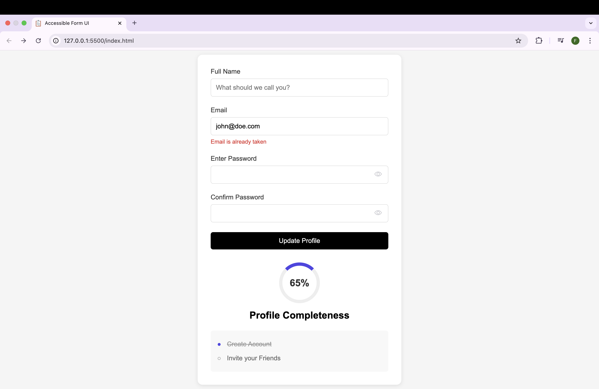

# Accessible Form UI

An accessible form interface with profile completion tracking. This project is part of the frontend learning path from [roadmap.sh](https://roadmap.sh/frontend).

## Live Demo
[View Demo](https://faizaazam-1.github.io/AccessibleUI-Form/)

## Preview

## Built With
- HTML5
- CSS3
- Accessibility best practices
- ARIA attributes

## Project Requirements
This project is created following the requirements from:
[https://roadmap.sh/projects/accessible-form-ui](https://roadmap.sh/projects/accessible-form-ui)

## Author
Faiza Azam
- GitHub: [@faizaazam-1](https://github.com/faizaazam-1)
